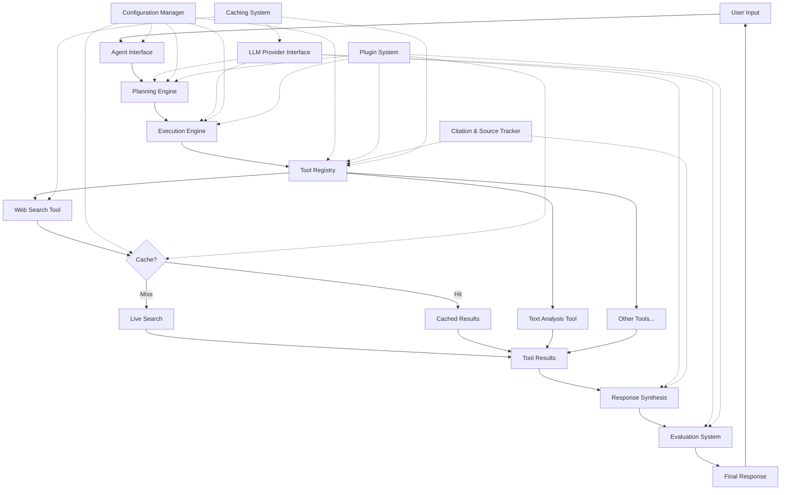
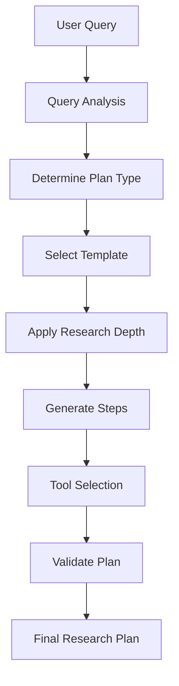
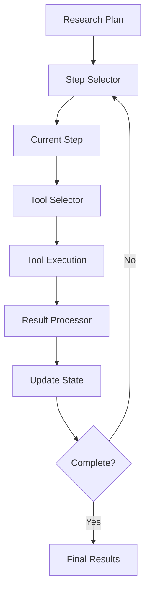
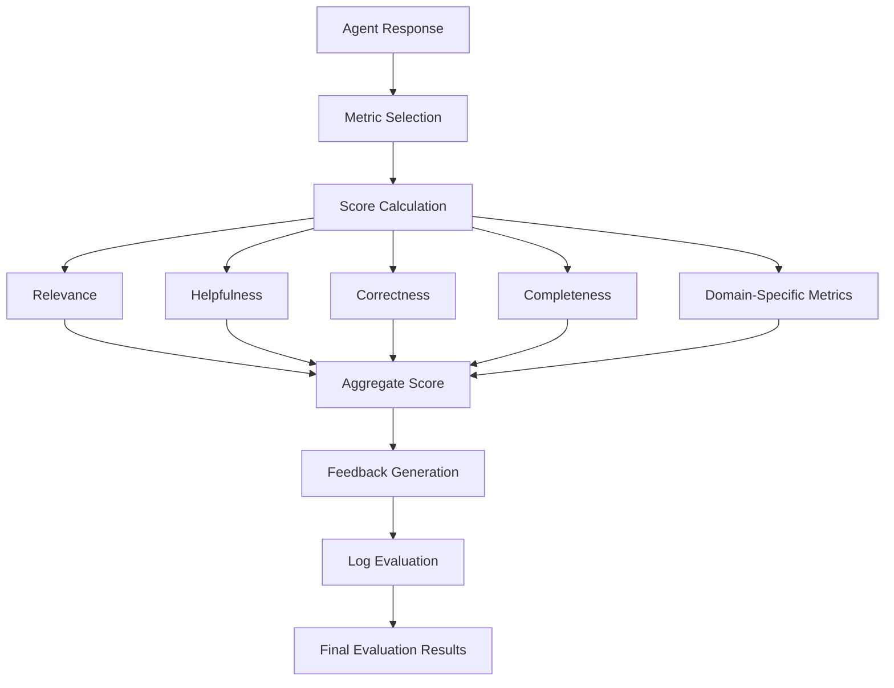

# 🤖 AI Agents Framework

A modular, extensible framework for building intelligent AI agents for various practical applications.

---

## 🌟 Featured Agents

### 📊 Finance Research Agent
An advanced agent for investment analysis and financial research that:
- Breaks down complex investment questions into detailed research plans
- Dynamically adjusts research based on gathered information
- Provides formatted, visual output suitable for client presentations
- Supports configurable research depth (light, standard, deep, expert)

---

## 🏗️ Framework Architecture

This project implements a modular agent architecture with the following components:

- **Core Components**: Base classes and interfaces for building agents
  - Planning Engine
  - Execution Engine
  - Evaluation System
  - Tool Registry
  - LLM Provider Interface
  - Configuration Manager
  - Citation & Source Tracker
  - Caching System

- **Plugin System**: Extend functionality without modifying core code
  - Tool Plugins
  - Planning Plugins
  - Evaluation Plugins
  - Output Formatters
  - Caching Plugins

- **Domain-Specific Agents**: Specialized agents built on the core framework
  - Finance Research Agent
  - (More coming soon)

### Agent Workflow Diagram



### Component-Level Diagrams

#### Planning Engine Workflow



#### Execution Engine Workflow



#### Evaluation System Workflow



---

## Tools vs. Plugins

### Tools

Tools are the actual functional components that agents use to perform specific tasks:

- **Definition**: A tool is a specific capability that an agent can use to accomplish a task, like searching the web, analyzing text, or processing data.
- **Examples**: `WebSearchTool`, `TextAnalysisTool`
- **Usage**: Tools are directly invoked by the execution engine when running plan steps.
- **Implementation**: Tools implement the `BaseTool` interface with an `execute()` method that performs the actual work.

Think of tools as the "verbs" or actions the agent can perform - searching, analyzing, calculating, etc.

### Plugins

Plugins are extension points for the framework that can modify or enhance various aspects of agent behavior:

- **Definition**: A plugin is a modular extension that hooks into the framework to add or modify functionality across different components.
- **Examples**: Planning plugins, evaluation plugins, tool plugins, output formatter plugins
- **Usage**: Plugins register with the framework and are called at specific hook points during agent execution.
- **Implementation**: Plugins implement the plugin interface for their specific type and register hook handlers.

Plugins are more about extending the framework's architecture and behavior, while tools are specific functional capabilities used by agents.

## When to Use Tools vs Plugins

**Use Tools When:**
- You need to add a specific action capability to an agent (like a new search provider)
- You're implementing a concrete function that an agent can directly use
- You want to provide a building block for agent plans

**Use Plugins When:**
- You want to modify how a component behaves (like the planning process)
- You're adding cross-cutting functionality that affects multiple components
- You need to hook into specific parts of the agent lifecycle
- You want to extend the framework without modifying core code

## Example Scenario

Let's say you want to add the ability for your agent to analyze financial statements:

1. **As a Tool**: You would create a `FinancialStatementAnalysisTool` that implements the `BaseTool` interface. The execution engine would directly invoke this tool during plan execution.

2. **As a Plugin**: You might create a `FinancialAnalysisPlugin` that registers with the framework and adds specialized planning templates, custom evaluation metrics, and domain-specific output formatting.

---

## 🛠️ Setup Instructions (macOS / Linux)

### 1. 🔧 Create the Virtual Environment

In your terminal, run:

```bash
python3 -m venv venv
```

This creates a folder named `venv/` containing the isolated Python environment.

---

### 2. ▶️ Activate the Virtual Environment

```bash
source venv/bin/activate
```

You should see `(venv)` at the beginning of your terminal prompt.

---

### 3. 📦 Install the Package

```bash
pip install -e .
```

This installs the package in development mode, allowing you to modify the code without reinstalling.

---

### 4. 🔑 Set Up Environment Variables

Create a `.env` file in the root directory with your API keys:

```
OPENAI_API_KEY=your_openai_api_key_here
TAVILY_API_KEY=your_tavily_api_key_here
```

---

### 5. 🚀 Run the Example Script

```bash
python examples/finance_research.py
```

This will start the finance research agent, allowing you to test different queries.

---

## 💻 Development with Makefile

The project includes a Makefile to simplify common development tasks. The Makefile provides a standardized way to perform various operations without having to remember complex commands.

### Available Make Commands

- `make setup`: Creates a virtual environment
- `make install`: Installs the package and dependencies
- `make test`: Runs all tests
- `make coverage`: Runs tests with coverage report
- `make lint`: Runs linting checks
- `make format`: Formats code using black and isort
- `make clean`: Removes build artifacts
- `make docs`: Generates documentation
- `make finance-example`: Runs the finance research example

### Examples

```bash
# Install the package and dependencies
make install

# Run all tests
make test

# Format your code
make format

# Run the finance example
make finance-example
```

By using these make commands, you can ensure consistent development practices and save time with shortcuts for common operations.

---

## 💻 Usage Examples

### Using the Finance Research Agent in Code

```python
from src.agents.finance import FinanceResearchAgent
from dotenv import load_dotenv

# Load environment variables
load_dotenv()

# Initialize the agent
agent = FinanceResearchAgent()

# Run an investment analysis
response = agent.analyze_investment(
    query="What are the investment prospects for AI stocks in 2025?",
    research_depth="deep",
    evaluate=True
)

# Print the results
print(response["response_text"])

# Print evaluation scores
if "evaluation" in response:
    for metric, score in response["evaluation"]["scores"].items():
        print(f"{metric}: {score:.2f}")
```

### Creating a Custom Agent

```python
from src.core.agent import BaseAgent
from src.core.planning import DefaultPlanningEngine

class MyCustomAgent(BaseAgent):
    """A custom agent implementation."""
    
    def __init__(self, config=None):
        # Configure your agent
        my_config = {
            "planning_engine_class": DefaultPlanningEngine,
            "evaluate_responses": True
        }
        
        # Initialize with custom config
        super().__init__(my_config)
    
    def run_my_task(self, query, context=None):
        """Run a custom task."""
        # Call the base run method
        return self.run(query, context=context)
```

---

## 📊 Research Depth Levels

The framework supports different research depth levels:

- **Light**: Quick overview with minimal sources (1-3 steps)
- **Standard**: Balanced approach with good coverage (3-7 steps)
- **Deep**: Comprehensive analysis for complex topics (8-15 steps)
- **Expert**: Exhaustive research for specialized domains (15+ steps)

---

## 🔄 Caching System

The framework includes a robust caching system to improve performance and reduce API calls:

### Cache Levels
- **Memory Cache**: For fast access to recent results
- **Disk Cache**: For persistent storage between sessions
- **Distributed Cache**: For multi-agent deployment (planned)

### What's Cached
- **Search Results**: Store web search results to reduce API calls
- **LLM Responses**: Cache responses to similar or identical queries
- **Tool Results**: Store results from expensive tool operations
- **Intermediate Results**: Support resumable operations

### Configuration Options
- **TTL (Time-to-Live)**: Configure how long items remain in cache
- **Size Limits**: Set maximum cache size for different levels
- **Invalidation Policies**: Control when cached items expire
- **Persistence Options**: Configure how cache is saved between runs

### Benefits
- **Reduced Latency**: Faster responses to repeated queries
- **Lower API Costs**: Fewer calls to paid services
- **Offline Capability**: Work with previously cached data when offline
- **Improved User Experience**: Consistent and faster response times

---

## 📁 Project Structure

```
.
├── src/                      # Source package
│   ├── core/                 # Core framework components
│   │   ├── agent.py          # Base agent class
│   │   ├── planning.py       # Planning engine
│   │   ├── execution.py      # Execution engine
│   │   ├── evaluation.py     # Evaluation system
│   │   ├── tools.py          # Tool registry
│   │   ├── llm.py            # LLM provider interface
│   │   ├── config.py         # Configuration manager
│   │   ├── citation.py       # Citation & source tracker
│   │   ├── logging_config.py # Centralized logging configuration
│   │   └── utils.py          # Utility functions
│   │
│   ├── plugins/              # Plugin implementations
│   │   ├── tools/            # Tool plugins
│   │   ├── planning/         # Planning plugins
│   │   └── evaluation/       # Evaluation plugins
│   │
│   └── agents/               # Domain-specific agents
│       └── finance/          # Finance research agent
│
├── examples/                 # Example scripts
│   ├── finance_research.py   # Finance agent example
│   └── test_tavily_api.py    # Tavily API test script
│
├── tests/                    # Unit and integration tests
│   └── test_core/            # Tests for core components
│
├── logs/                     # Log files directory
│
├── notebooks/                # Jupyter notebooks (for demos)
│   └── finance-research-agent/  # Original finance agent notebook
│
├── cleanup.py                # Code cleanup utility
├── run-finance-agent.sh      # Quick start script for finance agent
├── Makefile                  # Development task automation
├── setup.py                  # Package installation script
├── requirements.txt          # Dependencies
├── requirements-dev.txt      # Development dependencies
├── .env.example              # Example environment variables
├── AGENT_DEV_FRAMEWORK.md    # Detailed framework architecture
├── BACKLOG.md                # Future features and improvements
└── README.md                 # This file
```

---

## 🚧 Development Roadmap

- Add more domain-specific agents (Legal, Medical, etc.)
- Implement more tool plugins and data sources
- Create a web-based user interface
- Implement multi-agent collaboration

---

## 🔒 License

This project is licensed under the MIT License - see the LICENSE file for details.

---

Happy agent building! 🚀
