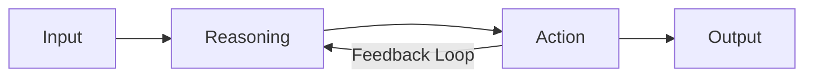

# What is an AI Agent?

## Definition

An AI agent is a software system that perceives its environment through inputs, makes decisions through reasoning processes, and acts upon its environment to achieve specific goals. Unlike conventional AI models that simply transform inputs into outputs, agents engage in ongoing, autonomous decision-making and action cycles.

## Core Components

### 1. Perception
- Receives and processes inputs from its environment
- Can include text, images, structured data, or sensor readings
- Transforms raw inputs into representations useful for reasoning

### 2. Reasoning
- Analyzes perceived information to make decisions
- Can range from simple rule application to complex planning
- Often involves problem decomposition, inference, or search algorithms

### 3. Action
- Executes decisions through defined capabilities
- May include generating text, invoking APIs, controlling systems
- Changes the state of the environment in pursuit of goals

### 4. Memory (optional)
- Stores information across multiple interaction cycles
- Enables learning from past experiences
- Can be short-term (context window) or long-term (persistent storage)

### 5. Learning (optional)
- Improves performance over time based on experience
- Can involve parameter updates, strategy refinement, or knowledge base expansion
- Ranges from manual feedback incorporation to autonomous adaptation

## Key Characteristics

### Goal-Oriented
Agents are designed to accomplish specific objectives, which may be explicitly defined or learned through experience.

### Autonomous
Agents can operate independently, making decisions without human intervention based on their programming and environmental inputs.

### Adaptive
Advanced agents can modify their behavior based on feedback, learning from successes and failures.

### Interactive
Agents engage in ongoing interactions with their environment, often including multi-turn conversations with humans.

### Specialized vs. General
Agents range from highly specialized (performing one narrow task extremely well) to more general-purpose (handling diverse tasks with varying efficiency).

## AI Agent Architecture

The architecture of an AI agent typically follows this general flow:

More sophisticated agents may incorporate additional components such as:
- Memory systems for retaining information across interactions
- Planning modules for multi-step reasoning
- Tool usage for extending capabilities
- Self-improvement mechanisms for learning from experiences

## The Difference Between AI Agents and Traditional AI Systems

| Feature | Traditional AI System | AI Agent |
|---------|----------------------|----------|
| Operation | Input ➝ Processing ➝ Output | Continuous cycle of perception, reasoning, and action |
| Autonomy | Limited, often needs specific inputs | Can initiate actions based on goals |
| Decision-making | Pre-defined responses to inputs | Can make decisions based on current state and goals |
| Learning | Often static after training | May continue to adapt and learn through interactions |
| Environment awareness | Limited or none | Designed to perceive and respond to environment changes |
| Tool usage | Limited capabilities | Can often use external tools to extend functionality |

## Applications of AI Agents

- **Personal assistants**: Managing schedules, answering questions, and performing tasks
- **Customer service**: Handling inquiries and resolving issues through conversation
- **Research assistants**: Gathering, analyzing, and synthesizing information
- **Autonomous systems**: Controlling vehicles, robots, or IoT devices
- **Game characters**: Creating dynamic, responsive NPCs in video games
- **Business process automation**: Performing complex workflows with minimal supervision

## Ethical Considerations

The development and deployment of AI agents raise important ethical considerations:

- **Transparency**: Users should understand when they're interacting with an agent
- **Control**: Humans should maintain appropriate oversight of agent actions
- **Bias**: Agents may replicate or amplify biases in their training data
- **Privacy**: Agents often process sensitive information that requires protection
- **Safety**: Agents with significant autonomy require robust safety mechanisms

## Future Directions

AI agents are evolving rapidly, with progress in several key areas:

- **Increasing autonomy**: Greater ability to operate independently
- **Improved reasoning**: More sophisticated problem-solving capabilities
- **Multi-agent systems**: Collaboration between specialized agents
- **Tool integration**: Seamless usage of diverse external tools and APIs
- **Personalization**: Adaptation to individual user preferences and needs
- **Broadened capabilities**: Expansion beyond text to multimodal interactions
