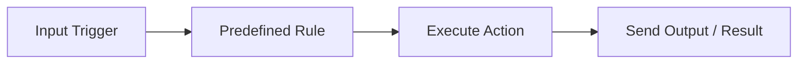
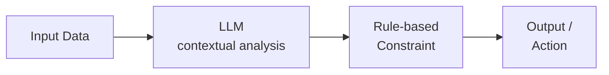
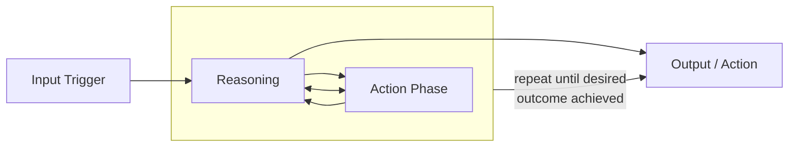
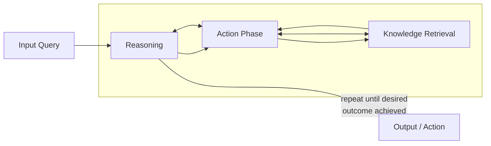
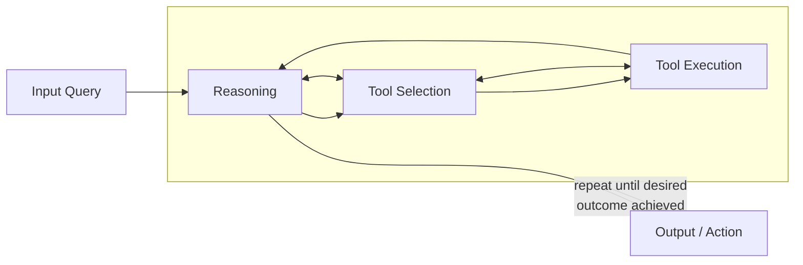
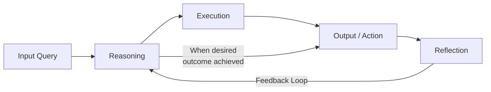
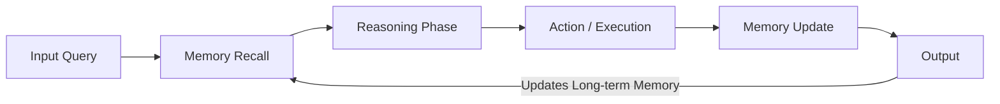
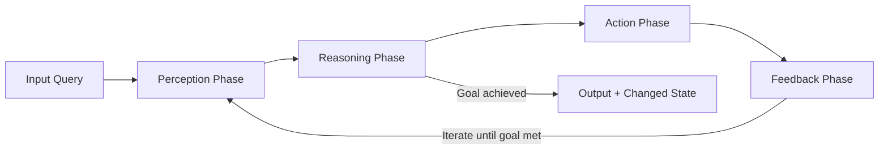
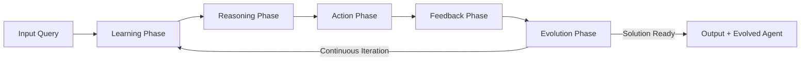

# Types of AI Agents

This document provides a comprehensive overview of different AI agent architectures, their key characteristics, and when to use each type.

## Comparison of AI Agent Types

| Name of the agent | Key Characteristics | Examples | Best For |
|-------------------|---------------------|----------|----------|
| Fixed Automation: The Digital Assembly Line | No intelligence, predictable behavior, limited scope | RPA, email autoresponders, basic scripts | Repetitive tasks, structured data, no need for adaptability |
| LLM-Enhanced: Smarter, but Not Einstein | Context-aware, rule-constrained, stateless | Email filters, content moderation, support ticket routing | Flexible tasks, high-volume/low-stakes, cost-sensitive scenarios |
| ReAct: Reasoning Meets Action | Multi-step workflows, dynamic planning, basic problem-solving | Travel planners, AI dungeon masters, project planning tools | Strategic planning, multi-stage queries, dynamic adjustments |
| ReAct + RAG: Grounded Intelligence | External knowledge access, low hallucinations, real-time data | Legal research tools, medical assistants, technical support | High-stakes decisions, domain-specific tasks, real-time knowledge needs |
| Tool-Enhanced: The Multi-Taskers | Multi-tool integration, dynamic execution, high automation | Code generation tools, data analysis bots | Complex workflows requiring multiple tools and APIs |
| Self-Reflecting: The Philosophers | Meta-cognition, explainability, self-improvement | Self-evaluating systems, QA agents | Tasks requiring accountability and improvement |
| Memory-Enhanced: The Personalized Powerhouses | Long-term memory, personalization, adaptive learning | Project management AI, personalized assistants | Individualized experiences, long-term interactions |
| Environment Controllers: The World Shapers | Active environment control, autonomous operation, feedback-driven | AutoGPT, adaptive robotics, smart cities | System control, IoT integration, autonomous operations |
| Self-Learning: The Evolutionaries | Autonomous learning, adaptive/scalable, evolutionary behavior | Neural networks, swarm AI, financial prediction models | Cutting-edge research, autonomous learning systems |

## Agent Architecture Flowcharts

### 1. Fixed Automation Agent

Fixed automation agents follow a linear, deterministic process with no intelligence or adaptability. They excel at repetitive, well-defined tasks where the rules never change.

### 2. LLM-Enhanced Agent

LLM-enhanced agents add basic intelligence through large language models, but still operate within rigid constraints and have no persistent state or memory across interactions.

### 3. ReAct Agent (Reasoning + Action)

ReAct agents combine reasoning with action in an iterative loop, enabling dynamic planning and more sophisticated problem-solving for multi-step workflows.

### 4. ReAct + RAG Agent (Retrieval-Augmented Generation)

ReAct + RAG agents extend the ReAct pattern by integrating external knowledge retrieval, dramatically reducing hallucinations and enabling access to real-time information.

### 5. Tool-Enhanced Agent

Tool-enhanced agents integrate with multiple external tools and APIs, dynamically selecting and using them to accomplish complex tasks requiring diverse capabilities.

### 6. Self-Reflecting Agent

Self-reflecting agents add a meta-cognitive layer, evaluating their own performance and adjusting their approach based on reflection, enabling continuous improvement.

### 7. Memory-Enhanced Agent

Memory-enhanced agents maintain persistent information across interactions, enabling personalization, contextual awareness, and learning from past experiences.

### 8. Environment Controller Agent

Environment controller agents actively modify their surroundings, using perception and feedback loops to achieve complex goals through autonomous operation.

### 9. Self-Learning Agent

Self-learning agents continuously evolve through autonomous learning, adapting their capabilities and strategies based on experience without requiring explicit human guidance.

## Making the Right Choice

Each agent architecture offers distinct advantages for different use cases. The architecture you choose should align with your specific requirements, including task complexity, domain knowledge needs, and desired level of autonomy.

For implementation guidance and practical considerations when building these agent types, refer to the "Selecting Agent Frameworks" documentation.
