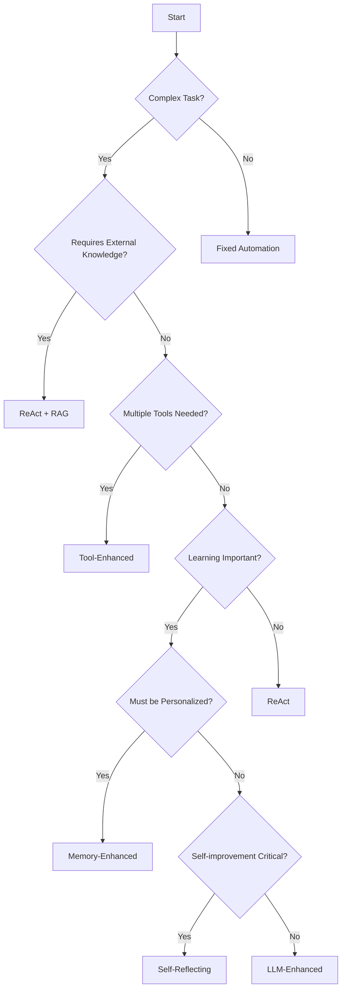

# 10 Questions to Ask Before You Consider an AI Agent

Before you consider using AI agents, you'll need to ask yourself a set of questions to help you evaluate if it's actually worth the time, capital, and resources you'll be putting into it:

## 01 What is the complexity of the task?

Is the task simple and repetitive, or does it involve complex decision-making that could benefit from automation?

## 02 How often does the task occur?

Is this a frequent task where automation could save significant time and resources, or is it a rare event that might not justify the investment?

## 03 What is the expected volume of data or queries?

Will the agent be handling large volumes of data or queries where speed and efficiency are crucial?

## 04 Does the task require adaptability?

Are the conditions under which the task is performed constantly changing, requiring adaptive responses that an AI can manage?

## 05 Can the task benefit from learning and evolving over time?

Is there a benefit to having a system that learns from its interactions and improves its responses or strategies over time?

## 06 What level of accuracy is required?

Is it critical that the task is performed with high accuracy, such as in medical or financial settings, where AI might need to meet high standards?

## 07 Is human expertise or emotional intelligence essential?

Does the task require deep domain knowledge, human intuition, or emotional empathy that AI currently cannot provide?

## 08 What are the privacy and security implications?

Does the task involve sensitive information that must be handled with strict privacy and security measures?

## 09 What are the regulatory and compliance requirements?

Are there specific industry regulations or compliance issues that need to be addressed when using AI?

## 10 What is the cost-benefit analysis?

Does the return on investment in terms of time saved, efficiency gained, and overall performance outweigh the costs of implementing and maintaining an AI system?

Take time to evaluate these questions; this will help you better determine if an AI agent fits your needs and how it could be effectively implemented to enhance your operations or services.

## Mapping Questions to Agent Types

| Question | Relevant Agent Types | Considerations |
|----------|---------------------|----------------|
| Task Complexity | Fixed Automation, ReAct, Tool-Enhanced | Higher complexity typically requires more sophisticated agent architectures |
| Task Frequency | Fixed Automation (high frequency), ReAct (variable frequency) | High-frequency tasks often justify more investment in automation |
| Data Volume | Tool-Enhanced, ReAct + RAG | Large data volumes may require agents with efficient processing capabilities |
| Adaptability | Self-Reflecting, Environment Controllers | Changing conditions need agents that can adapt their behavior |
| Learning Capability | Memory-Enhanced, Self-Learning | If improvement over time is important, agents with learning mechanisms are essential |
| Accuracy Requirements | ReAct + RAG, Tool-Enhanced | High-stakes decisions may require knowledge-grounded agents with fact-checking |
| Human Expertise Need | LLM-Enhanced, ReAct + RAG | Consider the balance between AI capabilities and human oversight |
| Privacy & Security | Any agent with appropriate safeguards | All architectures can implement security measures, but complexity adds risk |
| Regulatory Compliance | Fixed Automation (auditable), Self-Reflecting (traceable) | Some agent types provide better traceability for compliance |
| Cost-Benefit | Fixed Automation (lower cost), Tool-Enhanced (higher cost/benefit) | Simpler agents cost less but may offer fewer benefits |

## Decision Flowchart

This flowchart provides a simplified decision path to help you select an appropriate agent architecture based on your answers to the key questions.
